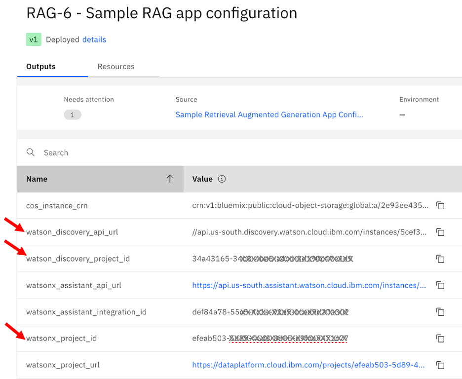
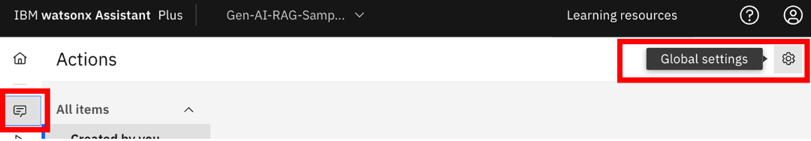
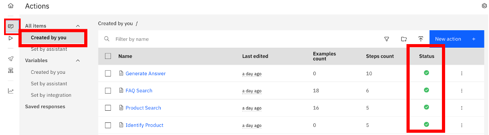

## Configuration steps for watsonx Assistant artifacts

The latest v2.0.0 of the [RAG Pattern deployable architecture](
https://cloud.ibm.com/catalog/7a4d68b4-cf8b-40cd-a3d1-f49aff526eb3/architecture/Retrieval_Augmented_Generation_Pattern-5fdd0045-30fc-4013-a8bc-6db9d5447a52-global) does not require any manual steps to configure watsonx Assistant. The deployable architecure automatically adds action and search skill to watsonx Assistant and configures Conversational Search with the provisioned Elasticsearch credentials and a keyword index of the sample data.

Follow the steps [here](https://github.com/terraform-ibm-modules/stack-retrieval-augmented-generation/blob/main/README.md#monitor-the-build-and-application-deployment) to monitor the deployment and launch the sample application.

---

Configurations steps for v1.x of [RAG Pattern deployable architecture](
https://cloud.ibm.com/catalog/7a4d68b4-cf8b-40cd-a3d1-f49aff526eb3/architecture/Retrieval_Augmented_Generation_Pattern-5fdd0045-30fc-4013-a8bc-6db9d5447a52-global) are provided below.

The *Gen AI Sample Application* requires configurations on watsonx Assistant to enable integration with Watson Discovery (for content search) and watsonx.ai (for generative ai tasks).

Follow the steps below to configure watsonx Assistant.

__Prerequisites:__
- The sample application webpage is up and running and shows a banner to complete the watsonx Assistant configurations. (Deployment was completed earlier using the *Retrieval Augmented Generation Pattern Deployabe Architecture Stack* in the IBM Cloud Account of your deployment.)
- You have Administrator privileges in the IBM Cloud Account to do the configurations. 

(The URL for the sample application (*e.g., https://rag-sample-app.absdefgh.us-south.codeengine.appdomain.cloud/*) is available from the Code Engine service that was deployed from the RAG Pattern DA Stack.)

__Configuraiton steps summary:__

1. Open the RAG Pattern DA Stack Project (to get configuration parameter values)
2. Open Secrets Manager (to get configuration api keys values)
3. Open watsonx Assistant (to start configuring watsonx Assistant)
4. Create and configure custom extension for Watson Discovery (configuration in watsonx Assistant)
5. Create and configure custom extension for watsonx.ai (configuration in watsonx Assistant)
6. Create the RAG pattern Action skill (configuration in watsonx Assistant)
7. Confirm uploads and imports are successful
8. Configure the Action session variable values  (configuration in watsonx Assistant)
9. Confirm sample application and watsonx Assistant are working correctly

__Configuraiton steps:__

### Step 1.	Open the RAG Pattern DA Stack Project

Login to IBM Cloud Account that was used for deployment and navigate to Projects.

Open the Project that was used for deploying the *Retrieval Augmented Generation Pattern Deployabe Architecture Stack (RAG Pattern DA Stack)*

In the RAG Pattern DA Stack, open the "RAG-6 - Sample RAG app configuration" Deployabe Architecture - Outputs tab.

Keep this window open. In later steps we will need the values for watson_discovery_project_id, watson_discovery_api_url and watsonx_project_id in the configuration.

### Step 2.	Open Secrets Manager

In the IBM Cloud Account, open Resource list and select the Secrets Manager instance that was deployed from the RAG Pattern Stack.

Naviage to Secrets. You should see the secrets "ibmcloud-api-key" and "watsonx-admin-api-key" (if it was used in the deployment).

Keep this window open. In later steps we will retrieve the api key for configuration.

### Step 3.	Open watsonx Assistant
In the IBM Cloud Account, open Resource list and select the watsonx Assistant instance that was deployed from the RAG Pattern Stack.

Launch watsonx Assistant UI and select __gen-ai-rag-sample-v1__ Assistant.

### Step 4.	Create and configure custom extension for Watson Discovery

This is done by importing the OpenAPI JSON file *watson-discovery-custom-ext-openapi.json*

Navigate left bottom menu to Integrations>Extensions>"Build custom extension"

Click Next. 

In the Basic Information, enter the following:

Extension name: __watson-discovery-custom-ext-v1__

Click Next. 

On Import OpenAPI, upload json file: __watson-discovery-custom-ext-openapi.json__

Get/download the watson-discovery-custom-ext-openapi.json file from > [here](https://github.com/IBM/gen-ai-rag-watsonx-sample-application/blob/main/artifacts/watsonx.Assistant/watson-discovery-custom-ext-openapi.json).
(Hint: Use  to download.)

Import/Upload the file. Click Next and Finish to save the custom extension.

Add/Open the __watson-discovery-custom-ext-v1__ custom extension tile.
 

Select/confirm to Add (to Draft environment)

Configure the authentication used by the extension during runtime. 

Select Authentication tab
 
Authentication Type: __Basic Auth__

Username: __apikey__

API Key: **_Retreive the "ibmcloud-api-key" or "watsonx-admin-api-key" from Secrets Mangager and enter here_**

(Hint: In Secrets Manager, use  to retreive the api key value.)

Servers - Server variable (Watson Discovery URL): **_Get the value for "watson_discovery_api_url" from the RAG-6 Outputs and enter here._** (exclude 'https://' in the entry.)

 

Next, Save/Finish and exit the configuration.

### Step 5.	Create and configure custom extension for watsonx.ai

This is done by importing the OpenAPI JSON file  *watsonxai-custom-ext-\<location\>-openapi.json*

Again click "Build custom extension", Next. 

In the Basic Information, enter the following:

Extension name: __watsonx-ai-custom-ext-v1__

Click Next. 

On Import OpenAPI, upload json file: __watsonxai-custom-ext-\<location\>-openapi.json__

Get/download the file for your locaiton. [File URLs: [us-south](https://github.com/IBM/gen-ai-rag-watsonx-sample-application/blob/main/artifacts/watsonx.Assistant/watsonxai-custom-ext-us-south-openapi.json), [eu-de](https://github.com/IBM/gen-ai-rag-watsonx-sample-application/blob/main/artifacts/watsonx.Assistant/watsonxai-custom-ext-eu-de-openapi.json), [jp-tok](https://github.com/IBM/gen-ai-rag-watsonx-sample-application/blob/main/artifacts/watsonx.Assistant/watsonxai-custom-ext-jp-tok-openapi.json)]

Import/Upload the file. Click Next and Finish to save the custom extension.

Add/Open the __watsonx-ai-custom-ext-v1__ custom extension tile

 
Select/confirm to Add (to Draft environment)

Configure the authentication used by the extension during runtime. 

Select Authentication tab.

Authentication Type: __OAuth 2.0__

Custom Secrets - Apikey:**_Retreive the "ibmcloud-api-key" or "watsonx-admin-api-key" from Secrets Mangager and enter here_**

Next, Save/Finish and exit the configuration.

### Step 6.	Create the RAG pattern Action skill
This is done by importing the OpenAPI JSON file *gen-ai-rag-sample-assistant-action.json*
 
Navigate Home>Actions> top right menu>Global settings>

Go to the tab > Upload/Download

Upload Action skill json file: __gen-ai-rag-sample-assistant-action.json__

Get/download the gen-ai-rag-sample-assistant-action.json file from > [here](https://github.com/IBM/gen-ai-rag-watsonx-sample-application/blob/main/artifacts/watsonx.Assistant/gen-ai-rag-sample-assistant-action.json)

Click on Upload and Replace. 

Close.

### Step 7.	Confirm uploads and imports are successful

Navigate Home>Actions> All items>Created by you. Status should be green
 

### Step 8.	Configure the Action session variable values

Navigate Home>Actions> Variables>Created by you

Enter search text "project" to find the project id session variables in the list.

Enter the values for __Watson Discovery Project ID__  and __watsonx.ai Project ID__ session variables

discovery_project_id: **_Get the value for "watson_discovery_project_id" from the RAG-6 Outputs and enter here._**

watsonx_project_id: **_Get the value for "watsonx_project_id" from the RAG-6 Outputs and enter here._**

### Step 9.	Confirm sample application and watsonx Assistant are working correctly

Launch the Gen AI Sample RAG pattern application. It can take a couple of minutes for the applicaiton webpage to launch if accessed for the first time or from a dormant state.

Open the virtual assistant. You should see a welcome message. "Welcome, how can I assist you?"

Ask the question:

"what is conventional fixed rate loan"

Response to the question confirms successful integration of watsonx Assistant with Watson Discovery and watsonx.ai.

**This completes the watsonx Assistant artifact configuration.**
